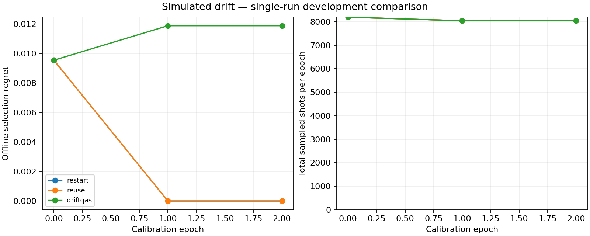
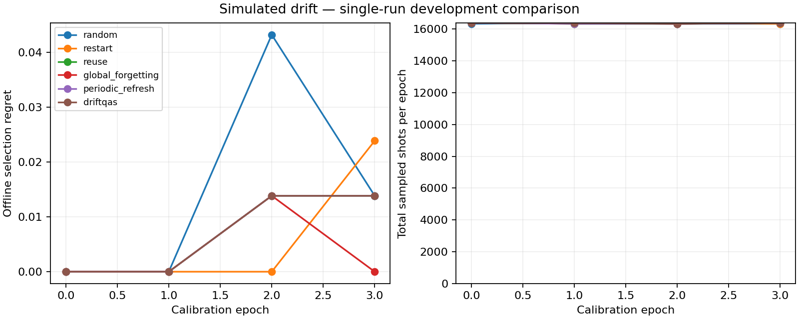

# Development results

These are actual single-seed local simulation runs, not a final research comparison.

Python 3.12; Qiskit 2.5.2; Aer 0.17.2. The checked-in manifests record the configuration, package versions, and source digest.

Selection regret uses an independent density-matrix audit of the frozen candidate bank. Lower is better. Confirmation measurements were taken after the recommendation was locked.

## H2

| Policy | Mean epoch regret | Final epoch regret | Total online shots |
|---|---:|---:|---:|
| restart | 0.003183 | 0.000000 | 24268 |
| reuse | 0.003183 | 0.000000 | 24268 |
| driftqas | 0.011109 | 0.011889 | 24268 |

Shared ideal bank preparation: 542 objective calls. This is reported separately from online-shot totals.

## Four-qubit Ising

| Policy | Mean epoch regret | Final epoch regret | Total online shots |
|---|---:|---:|---:|
| random | 0.014246 | 0.013827 | 65380 |
| restart | 0.005963 | 0.023851 | 65432 |
| reuse | 0.006914 | 0.013827 | 65432 |
| global_forgetting | 0.003457 | 0.000000 | 65484 |
| periodic_refresh | 0.006914 | 0.013827 | 65432 |
| driftqas | 0.006914 | 0.013827 | 65484 |

Shared ideal bank preparation: 1871 objective calls. This is reported separately from online-shot totals.

## Interpretation

DriftQAS did not consistently outperform the controls. It had higher mean regret in the H2 smoke run and matched unchanged reuse in the four-qubit run; global forgetting had lower mean regret in that Ising run. These observations validate the executable comparison pipeline, not the proposed research benefit.

No inference about statistical superiority should be made from one seed. The next research steps are development-only tuning, held-out repeated-seed comparisons, ablations, and tests of whether footprint exposure predicts real performance changes. Keep these unfavorable results visible.

The online selector uses a staged heuristic and a fixed-kernel GP. Its relevance scales and uncertainty have not been empirically calibrated. The broader project plan remains a research agenda.

Reproduce with `configs/smoke.yaml` or `configs/ising.yaml` using a fresh output directory. The run exports raw counts and SQLite events locally; compact summaries and figures are checked in here.
