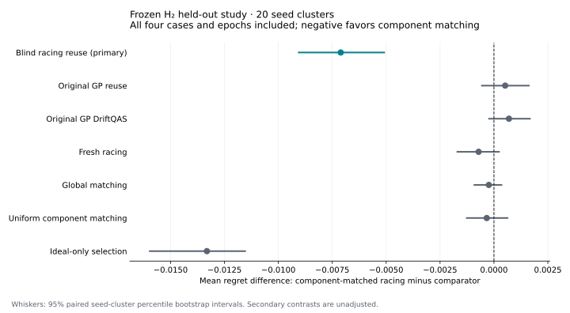

# Frozen exposure study (v0.4)

This study evaluates component-matched evidence reuse in a frozen, ideal-trained circuit
library under synthetic CX noise. Its primary comparison uses the same racing model for
both policies, changing only which historical observations remain compatible. The original
GP policies and the fresh, global, uniform and ideal-only controls remain in the report.

On **20 fresh H₂ seed clusters**, component-matched racing reduced mean selection regret
from **0.0107094 to 0.00360119** compared with blind racing reuse: **66.4% lower**.
The predeclared paired difference was **−0.00710821**, with 95% seed-cluster bootstrap
interval **[−0.00909278, −0.00505381]**; 18 seeds favored matching and 2 favored blind reuse.
The mean-regret intervals against the original GP, fresh, global and uniform controls
include zero. This establishes a limited simulator result against stale blind reuse;
it does not establish superiority over the stronger controls.

The completed test contains **80 paired episodes**, 640 policy episodes, 2,560 locked
recommendations and 20,480 full-bank predictions. Its protocol digest is
`424b12c357430b32fbde3d6b24ea7d1ba7a53bdbf1ea36765099a99135090980`.
Exact values, every contrast and per-seed records are in
[the verified held-out export](../examples/benchmarks/v04/h2-held-out/report.md).



## Selection and resource use

All rows average the four cases and four epochs within each seed, then average seeds.
Shots include fresh confirmation and measure actual spending under the common cap.

| Policy | Mean regret | Mean shots / epoch | Budget used |
|---|---:|---:|---:|
| Original GP reuse | 0.00307979 | 2,015.25 | 98.40% |
| Original GP DriftQAS | 0.00290463 | 2,015.50 | 98.41% |
| Ideal-only | 0.0169165 | 408.00 | 19.92% |
| Fresh racing | 0.00431256 | 2,045.43 | 99.87% |
| Blind racing reuse | 0.0107094 | 2,046.88 | 99.95% |
| Global matching | 0.00383817 | 2,043.68 | 99.79% |
| **Component-matched racing** | **0.00360119** | **2,034.85** | **99.36%** |
| Uniform component matching | 0.00393561 | 2,045.75 | 99.89% |

Matching used only about 0.6% fewer shots than blind racing reuse. Most controllers spent
nearly the full budget; substantial shot savings or CPU speedups are not established.
The GP controls have lower point-estimate mean regret, while their paired differences
from component matching are inconclusive. Racing's adaptive allocation is also not
separated from the uniform component-matching control on this metric.

| Case | Matching minus blind mean regret | Descriptive 95% interval | Better / tied / worse seeds |
|---|---:|---|---|
| Stable | 0 | [0, 0] | 0 / 20 / 0 |
| Mild abrupt | −0.000898227 | [−0.00281985, 0.000982061] | 11 / 3 / 6 |
| Stress abrupt | −0.0165030 | [−0.0223842, −0.0107079] | 14 / 6 / 0 |
| Stress recurring | −0.0110316 | [−0.0152445, −0.00681512] | 17 / 0 / 3 |

The gain concentrates in the predeclared stress cases. Stable policies tie exactly, and
the mild case does not separate from zero on mean regret. Exact offline audits detect
genuine winner reversals in all 20 seeds of each changing case and none of the stable
seeds. There are **zero zero-exposure invariance violations**. The within-bank exposure/
score-shift Spearman association, averaged within seed first, is approximately **0.948**
for the changing cases; it is undefined for stable constant inputs. These diagnostics
were hidden from every online controller.

## Uncertainty: coverage and width together

Each policy's fixed interval scale uses the maximum normalized residual within each of
20 separate calibration clusters, then the largest cluster score at nominal 95% coverage.
One held-out joint trial contains all **128 case/epoch/candidate predictions** for one
seed and policy. Point rates aggregate correlated predictions and are descriptive.
Widths below are full interval lengths in the Hamiltonian's energy units, averaged over
the full bank; selected-candidate widths are reported separately in the CSV exports.

| Policy | Selected raw / calibrated | Full bank raw / calibrated | Joint seeds raw → calibrated (of 20) | Mean bank width raw → calibrated |
|---|---:|---:|---:|---:|
| Original GP reuse | 46.56% / 99.38% | 84.96% / 99.88% | 0 → 17 | 0.10615 → 0.26794 |
| Original GP DriftQAS | 47.81% / 99.69% | 84.80% / 99.92% | 0 → 18 | 0.10253 → 0.25657 |
| Ideal-only | 100% / 100% | 98.36% / 100% | 9 → 20 | 0.39199 → 0.51277 |
| Fresh racing | 60.00% / 99.06% | 91.41% / 99.88% | 0 → 17 | 0.12173 → 0.33039 |
| Blind racing reuse | 61.88% / 99.69% | 73.95% / 99.96% | 0 → 19 | 0.07476 → 0.75384 |
| Global matching | 70.31% / 99.38% | 93.24% / 99.88% | 0 → 18 | 0.09950 → 0.21818 |
| **Component-matched racing** | **71.56% / 99.69%** | **93.24% / 99.92%** | **1 → 19** | **0.09552 → 0.20944** |
| Uniform component matching | 76.88% / 100% | 93.87% / 99.96% | 0 → 19 | 0.08187 → 0.17953 |

For component matching, joint coverage rises from 1/20 to **19/20**, with a fixed
temperature of **2.193**. Mean selected calibrated width is **0.13421**, compared with
**0.55951** for blind reuse, whose temperature is **10.083**. These widths are substantial
relative to the regret differences. High coverage does not establish a precise ranking
model. Several other policies cover only 17 or 18 joint test clusters despite very high
point coverage. No policy's twenty-cluster estimate certifies its nominal coverage, and
the intervals supply no simultaneous guarantee across all policies or online stopping times.

## What was frozen

The H₂ study has 8 candidates, 4 epochs, and a 2,048-shot cap per policy/epoch, including
408 protected fresh confirmation shots. Each shared candidate has at most 120 ideal
training objective calls. Stable, mild abrupt (`0.04`), stress abrupt (`0.12`) and stress
recurring (`0.12`) CX depolarizing cases all contribute equally to the primary average.
These stress settings are synthetic and do not represent typical device error rates.

Five development seed clusters informed debugging. Twenty disjoint calibration clusters
fit the posthoc interval scales; twenty new test clusters evaluate the frozen controller
and fixed scales. Each cluster spans every case and epoch. The primary estimand is
`driftqas_racing - reuse_racing` in mean exact selection regret, averaged within seed
before bootstrapping 10,000 seed-cluster resamples. Secondary intervals are descriptive
and unadjusted. Regret is relative to the current noisy optimum within the prepared bank,
not the Hamiltonian ground state or unrestricted circuit search.

The [replacement freeze](../examples/benchmarks/v04/frozen_protocol_v2.json) was committed
as `439c5b9d30b9273166dac2883732dce190f21162` before the test. The
[calibration artifact](../examples/benchmarks/v04/interval_calibration.json) was committed
as `b242814d13c74fc5768352a626d4f74e56a49072` before the test began. Calibration never
changes online predictions, recommendations, acquisition or stopping. Full-bank predictions
and recommendations are locked before fresh confirmation; exact audits occur after all
policies finish. See [the complete method and assumptions](exposure_protocol.md).

## Development and the preserved failure

Development is distinct from the final test. The H₂ development contrast was −0.0103877,
with five-seed descriptive interval [−0.0138824, −0.0068929]. The secondary four-qubit
Ising development contrast was **+0.000215842**, with interval [0, 0.000647527]: circuit
matching did not help blind racing reuse. The Ising banks showed score shifts but no
genuine winner reversals, so they do not establish transfer or a broader selection benefit.
Both development studies had zero zero-exposure invariance violations.

The first calibration attempt finished computation but failed final checksum verification:
recursive sealing had inadvertently included environment-created transport temporaries.
All canonical data hashes and SQLite/JSONL parity were intact. The failed attempt and its
original freeze remain preserved. A regression-tested explicit core-artifact/QASM seal
fixed the problem, and all 80 calibration episodes were rerun from scratch with the same
seeds and controller settings under a new freeze. It is one calibration partition, not
two independent studies. See [the failure record](../examples/benchmarks/v04/calibration_failure.md).

## Interpretation boundaries

H₂ has one CX edge. It tests rejection of stale evidence, while the local/global
compatibility distinction primarily concerns circuits with no CX exposure. A stronger
locality claim needs fresh multi-edge test tasks with genuine winner reversals. The Ising
development result remains an unfavorable control, rather than being relabeled final evidence.

The bank and parameters are fixed before online selection. Exact error dictionaries are
available under a CX-only simulation model; readout, single-qubit errors, crosstalk,
calibration uncertainty, noisy parameter training and physical hardware are outside this
study. Racing and GP uncertainties are heuristics. The posthoc seed-cluster rank construction
needs exchangeable independent clusters under the same frozen protocol; deterministic seed
lists do not prove that assumption. Twenty test clusters cannot certify 95% coverage or
arbitrary hardware drift. No hardware speedup, quantum advantage, general superiority,
unrestricted QAS or novelty claim follows from this milestone.

## Evidence and reproduction

Compact results and per-episode artifact hashes are in
[the study directory](../examples/benchmarks/v04/README.md). Compact exports omit raw logs
and cannot serve as inputs to suite analysis. Full raw evidence is archived separately
with counts, locked predictions, audits, ledgers, trained banks, QASM, manifests and original
completion receipts. The failed calibration is retained for audit only and intentionally
remains invalid input to complete-pair analysis.

The downloadable `DriftQAS_v04_raw_evidence.zip` contains 10,270 verified files: 190 completed
paired episodes across development/calibration/test, plus 80 failed-attempt episodes for
audit only. [Its catalogue and SHA256](../examples/benchmarks/v04/evidence_bundle.json) bind
the archive bytes. Only the 20 held-out seed clusters enter the primary final inference.

All 73 local tests pass. Strict held-out resume, full database/JSONL parity, canonical
artifact checksums, complete-grid/chronology diagnostics, calibration evaluation and compact
export verification passed. An initial resume check found a stale runtime lock after the
completed process exited; with no writer remaining, only that lock was removed before
successful verification. No sealed artifact, controller setting, seed or fitted scale changed.

Recreate full suites with the commands in the protocol and its exact frozen environment,
or make a new freeze and output directories for another environment. Read-only analysis
can reconstruct reports from extracted complete raw suites:

```bash
python -m driftqas analyze-suite --suite-dir v04-h2-held-out
python -m driftqas diagnose-suite --suite-dir v04-h2-held-out
python -m driftqas evaluate-calibration --suite-dir v04-h2-held-out \
  --calibration examples/benchmarks/v04/interval_calibration.json
python scripts/plot_exposure_study.py \
  --export-dir examples/benchmarks/v04/h2-held-out --output results/contrasts.svg
```

`scripts/export_study.py` creates checksum-verified compact exports; `scripts/bundle_evidence.py`
creates and verifies the raw ZIP without source code or incidental transport files.
The numerical/controller/protocol tests and the small CI calibration/test pipeline are
software validation, not additional research seeds.
