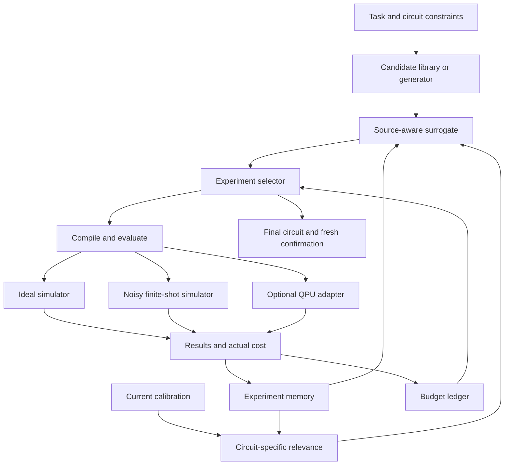

# DriftQAS — Complete Research and Implementation Plan

**Working title:** Circuit-Aware Evidence Reuse for Budgeted Quantum Architecture Search under Calibration Drift  
**Owner:** Kowshik Padala  
**Repository:** https://github.com/kowshikdev/DriftQAS  
**Plan date:** 6 October 2026  
**Planning assumption:** One developer, approximately 10–15 focused hours per week; an initial laptop-based implementation.

## 1. The project we are actually building

DriftQAS is a classical search controller that chooses useful experiments on quantum circuits. It receives a quantum task, candidate circuits, hardware-condition information, experiment history, and a budget. It recommends a circuit and its trained parameters, supported by an independent current-condition evaluation.

The central research question is:

> Can circuit-specific reuse and selective revalidation of old experiments improve quantum circuit selection after calibration changes, at the same total experimental cost?

The controller must choose between evaluating a new architecture, measuring an existing architecture more precisely, and checking whether an old result is still relevant. It also chooses the evaluation source and measurement allocation.

An example explains the proposed contribution. If an error rate changes on physical connection `(1, 2)`, a circuit repeatedly using that connection should receive a different evidence-relevance adjustment from one that does not use it. We will investigate whether this distinction produces better decisions than restarting, remembering everything unchanged, or applying the same forgetting rate to every circuit.

**The first deliverable is a reproducible research prototype.** An LLM agent, production service, and large website are optional later projects. “Autonomous” here means the controller executes its experimental decision loop without a person picking every experiment.

## 2. Why quantum computing is involved

The object being designed is a parameterized quantum circuit. Its architecture specifies the gates, their order, and the qubits they operate on. Its parameters specify trainable gate angles. For a VQE benchmark, the circuit prepares a trial state, measurements estimate its energy, and a classical optimizer adjusts the angles.

The search algorithm, database, optimizer, and surrogate run classically. A simulator initially evaluates circuit behavior. An optional QPU adapter later runs selected circuits on physical hardware. A simulator-based project can establish a quantum-algorithm design result; it cannot establish a hardware speedup or quantum computational advantage.

The small H₂ VQE example in the [Qiskit Algorithms tutorial](https://qiskit-community.github.io/qiskit-algorithms/tutorials/01_algorithms_introduction.html) provides a two-qubit Hamiltonian and a reproducible reference calculation. It will be our learning and correctness example, rather than the sole research benchmark.

## 3. Originality: what is established and what must be tested

The proposed contribution is a hypothesis, not an established novelty claim. We will maintain a literature matrix before selecting a publication claim.

| Related work | Established direction | DriftQAS question to compare against it |
|---|---|---|
| [QuantumNAS](https://hanlab.mit.edu/projects/quantumnas), HPCA 2022 | Noise-adaptive circuit and qubit-mapping search; shared circuit training | How is old experimental evidence revalidated across calibration changes under an explicit budget? |
| [Ye and Chen](https://arxiv.org/abs/2112.05779), 2021 preprint | Continual reinforcement learning and policy reuse under changing device noise | Does circuit-specific experimental evidence reuse improve allocation beyond policy reuse or global forgetting? |
| [Graph-Based Bayesian QAS](https://arxiv.org/abs/2512.09586), 2025 preprint, revised July 2026 | Graph-based surrogate, uncertainty-guided search, noise robustness study | How are stale observations, revalidation actions, and all measurement costs handled? |
| [CL-QAS](https://arxiv.org/abs/2601.06392), January 2026 preprint | Continual architecture learning across sequential signal tasks | How does calibration-driven experiment reuse differ from retention across learning tasks? |
| [SQuASH](https://arxiv.org/abs/2506.06762), 2025 preprint | Surrogate-assisted QAS benchmark and released data | Can its benchmarking practices inform a chronological drift benchmark? |
| [Shot-Efficient ADAPT-VQE](https://arxiv.org/abs/2507.16879), 2025 preprint | Reuse of Pauli measurements and variance-based shot allocation | Does reuse address the same architecture-selection problem under changing execution conditions? |
| [MAESTROCUT](https://arxiv.org/abs/2509.00811), 2025 preprint | Drift-responsive circuit cutting and shot allocation | Which scheduling and drift mechanisms already exist in adjacent quantum workflows? |

This source check establishes that several ingredients already have precedents. It does not establish that the full DriftQAS combination is first. Complete full-paper and code comparisons for the closest methods, including follow-up and citing work, before making a novelty claim.

The strongest proposed contribution is a measurable connection between **compiled circuit dependence on hardware**, **relevance of historical observations**, and **budgeted revalidation decisions**. A second potential contribution is a public chronological benchmark with full cost records. A better-looking dashboard is presentation, not evidence of algorithmic novelty.

## 4. Scope and staged releases

**Implementation update (v0.4):** the current v0.4 is an evidence-validation milestone:
component-matched racing, exposure/ranking checks, and frozen three-partition uncertainty
evaluation. It remains finite-library selection. The original release sequence below is
a roadmap, not a statement that unrestricted generation, online noisy training, or hardware
execution has shipped. See [the v0.4 protocol](exposure_protocol.md).

The [completed v0.4 study](exposure_results.md) now includes 20 fresh H₂ test clusters:
lower regret than blind racing reuse, without establishing an advantage over the stronger
controls. Joint posthoc coverage and interval widths are reported together. The unfavorable
multi-edge Ising development result remains visible; a broader locality claim still needs
new multi-edge held-out tasks with genuine ranking changes.

| Release | Required behavior | Completion evidence |
|---|---|---|
| v0.1 — Quantum evaluation foundation | H₂ VQE; exact and finite-shot energy estimation; noise injection; cost logging | Numerical reference agreement and a reproducible small experiment |
| v0.2 — Controlled drift prototype | Fixed candidate library and parameters; changing gate noise; baseline policies; circuit-specific relevance | Complete chronological runs with budgets enforced |
| v0.3 — Research prototype | Multi-source/shot selection; selective revalidation; held-out tests; larger tasks; ablations | Results with uncertainty and comparisons against strong controls |
| v0.4 — End-to-end architecture search | New candidate proposals and parameter optimization inside the loop | Training, proposal, and search costs included in the same accounting |
| v0.5 — Optional hardware demonstration | Calibration capture, target-aware compilation, QPU jobs, execution metadata | Physical measurements and an explicitly limited hardware claim |

The controlled v0.2 comparison isolates evidence management from optimization and architecture generation. It is finite-library architecture selection. Claims about unrestricted architecture generation require v0.4.

## 5. Functional requirements

| ID | Requirement | Acceptance condition |
|---|---|---|
| FR-01 | Load a task with a fixed objective, Hamiltonian/target, and reference | Task specification, units, offsets, and reference calculation are versioned |
| FR-02 | Represent and identify candidate architectures and parameter sets | Changing gate order, mapping, parameters, or measurement circuit changes the correct identity |
| FR-03 | Compile for a declared target and extract a physical footprint | Unsupported instructions or couplings fail validation; basis-change circuits are included |
| FR-04 | Evaluate ideal and noisy circuits with explicit measurement allocation | Every result has an evaluation source, conditions, means, uncertainty, and cost |
| FR-05 | Supply calibration snapshots in chronological order | The policy sees no future snapshot, audit score, or test label |
| FR-06 | Maintain persistent experiment history | Records survive restart and retain raw or sufficient measurement statistics |
| FR-07 | Assess circuit-specific relevance of historical measurements | Used and unused hardware changes can affect relevance differently |
| FR-08 | Select exploration, precision increases, or revalidation actions | Every action records its reason, predicted value, and estimated cost |
| FR-09 | Enforce resource limits before execution | Training, measurement groups, revalidation, retries, and final confirmation are accounted for |
| FR-10 | Fit a source-aware predictive model | Ideal and noisy results are not silently treated as interchangeable labels |
| FR-11 | Compare all policies through one evaluator and ledger | Same task, initial information, budgets, and scoring convention |
| FR-12 | Independently confirm the final recommendation | Fresh current-condition measurements are separate from search observations |
| FR-13 | Export results and a reusable circuit | Configuration, circuit, parameters, calibration, seed, costs, and software versions are included |
| FR-14 | Resume an interrupted run | Saved RNG states, experiment IDs, and committed ledger reproduce the next action |

Nonfunctional requirements are reproducibility, understandable decision logs, small-task CPU support, bounded resource use, and adapters that keep task, policy, and execution code separate. Target a smoke run of minutes and an individual research episode of at most a few minutes after profiling; these are engineering targets, not measured performance.

## 6. Benchmark tasks and search space

**Learning task:** the two-qubit H₂ Hamiltonian from the Qiskit Algorithms example. Store exact coefficients, qubit ordering, provenance, and any energy offset. Its reference should come from diagonalizing that same operator. Do not mix electronic energy with a total molecular energy using a different offset.

**Primary research task:** small transverse-field Ising Hamiltonians, generated from a fixed specification:

\[
H=-J\sum_{i=0}^{n-2} Z_iZ_{i+1}-h\sum_{i=0}^{n-1}X_i.
\]

Begin with four qubits, open boundaries, `J = 1`, and two predetermined field strengths, for example `h/J = 0.5` and `1.5`. Validate transfer with six qubits. Exact diagonalization is inexpensive at these sizes and gives an independent reference. Keep Hamiltonian changes separate from hardware drift: the task remains fixed within each episode.

**Optional second family:** small target-state preparation tasks with known states and a separately specified measurement objective. Add this after the primary family works; it tests generality without a labeled classification dataset.

The initial architecture library contains about 64 unique candidates. Include a shallow human-designed control plus seeded variations in depth, rotation pattern, and entangling pattern. Use one to four logical layers initially, `RY/RZ` rotations, and declared nearest-neighbor `CX` or `CZ` entanglers. These logical gates must be compiled to the target’s actual native instructions. Gate names and error parameters must match the compiled circuits.

For v0.2, use a fixed physical topology and mapping. For v0.4, mutate a circuit by adding/removing a gate, changing a rotation pattern, or changing an allowed entangler. Reject invalid or duplicate proposals. Mapping search is a later extension, because it changes what the evidence-relevance mechanism must compare.

Set maximum parameter count, compiled depth, and entangler count in configuration. A practical initial parameter cap is 48; treat it as a configurable compute constraint. Expand only if the pilot demonstrates that the restricted space is too weak.

## 7. Data requirements

No Kaggle-style labeled dataset is required for the primary task. DriftQAS generates much of its own training data.

| Data | How it is obtained | Required contents |
|---|---|---|
| Task definitions | Fixed Hamiltonians and generated small task instances | Coefficients/targets, dimensions, reference, units, provenance |
| Candidate library | Seeded generation plus a few fixed controls | Gate sequence, architecture ID, initial parameters, constraints |
| Calibration stream | Controlled simulated changes; later snapshots from a device | Native instructions, couplings, error information, timestamps, units |
| Experiment history | Actual training and circuit measurements | Results, uncertainty, source, cost, conditions, parameters, seeds |
| Audit references | Offline evaluator hidden from the controller | True current-condition score of the fixed candidate library |

Keep development and final test episodes distinct. Development uses different seeds and drift realizations from the final comparison. A static surrogate dataset such as SQuASH can be useful for prototyping, but does not by itself establish performance under a chronological calibration-drift protocol.

## 8. Architecture



The offline audit evaluator is deliberately outside this decision loop. It assesses recommendations for the researcher, without giving the policy access to every candidate’s true score.

| Module | Responsibility |
|---|---|
| Task adapter | Hamiltonian/target, objective, measurement grouping, reference |
| Circuit adapter | Canonical architecture, parameters, mutation, compilation, footprint |
| Calibration adapter | Validated chronological snapshots and missing-information flags |
| Evaluator | Exact expectations or explicit finite-shot measurements under declared conditions |
| Evidence memory | Immutable experiment records and retrieval by task, circuit, conditions, and source |
| Relevance model | Which historical observations depend on changed hardware components |
| Surrogate | Target-condition performance prediction with model uncertainty |
| Selector | Affordable exploration, promotion, repeated measurement, or revalidation |
| Ledger | Reserve, charge, refund, and audit all declared resources |
| Analysis | Held-out recommendations, independent checks, metrics, figures, and exports |

This design can initially be a Python package and CLI with SQLite storage. A server, vector database, Redis, and multiple agents are unnecessary for the first research loop.

## 9. Evaluation sources, shots, and statistical uncertainty

We must distinguish approximation bias from sampling uncertainty. An ideal simulator can be exact for an ideal circuit while being a poor predictor of current hardware behavior. A more precise estimate under the wrong noise model remains biased.

| Mode | First implementation | Role and limitation |
|---|---|---|
| F0 | Exact ideal statevector energy with a bounded parameter-training schedule | Useful screening/initialization; different target from noisy execution |
| F1 | Current declared noise model, initially 128 shots per measurement group | Cheap, uncertain estimate of the noisy target |
| F2 | Same declared noise model, initially 512 shots per group; 2,048 for close comparisons | More precise estimate; still conditional on the model’s correctness |
| F3, optional | Physical QPU measurement at an explicit shot allocation | Hardware evidence, subject to queueing and calibration limitations |

These are configurable starting allocations, not established optimal values. Add shots to an existing estimate only if its task, circuit, parameters, mapping, noise conditions, and measurement method remain compatible. Keep counts under changed conditions as distinct records.

F1/F2 measure the same modeled target at different precision. F0/F2 combine distinct sources with different systematic bias. The method earns a multi-source or multi-fidelity description only if it models this relationship and demonstrates useful allocation; a fixed progression through three modes alone is insufficient.

Use explicit shot execution through `AerSimulator` or an appropriate sampling interface. Build Pauli basis-change measurement circuits, group qubit-wise commuting terms, and store counts. Do not translate an estimator’s requested precision into an exact physical shot count without verifying the execution metadata. IBM documents [exact/noisy Aer simulation](https://quantum.cloud.ibm.com/docs/en/guides/simulate-with-qiskit-aer); the [AerSimulator reference](https://qiskit.github.io/qiskit-aer/stubs/qiskit_aer.AerSimulator.html) supplies the execution interface.

For each measurement group, compute the energy contribution from every sampled bitstring. This retains covariance between Pauli terms measured together. With independent groups, estimated energy variance is the sum of each group’s contribution variance divided by its shot count. Include uncertainty when comparing candidates.

In the primary gate-noise benchmark, set readout error to zero. This isolates the initial mechanism. Readout-drift tests are an extension with a declared raw or corrected estimator; quantify readout bias and include any calibration/mitigation cost. Measurement distortion can make a reported energy look better without improving the prepared state.

For final reporting, distinguish:

- The controller’s measured energy estimate and its standard error.
- The offline physical-state energy under the declared gate-noise model.
- The ideal reference ground-state energy of the same Hamiltonian.

A sampled estimate can fall below the ground-state reference because of uncertainty or bias. Preserve it with its interval rather than silently clipping it. Do not interpret that event as outperforming the ground state.

## 10. Circuit-specific evidence relevance

Record the compiled footprint of each complete measurement experiment: native gate counts per physical component, measured qubits, basis-change operations, depth, and, when available, scheduled durations. A change on an unused component should normally have little effect under the initial local-noise model. Crosstalk and unobserved disturbances can violate this assumption and belong in robustness tests.

For a historical observation `i`, define a prototype drift exposure:

\[
D_i(t)=\sum_j a_{ij}\frac{|z_j(t)-z_j(t_i)|}{s_j+\epsilon},
\qquad w_i(t)=\exp[-\lambda D_i(t)].
\]

Here `z_j` is a calibration feature, `a_ij` is the old compiled experiment’s dependence on that component, `s_j` is a scale fixed from development data, and `lambda` controls discounting. Gate error features can use execution counts; relaxation-rate features need an exposure based on duration, rather than an unscaled gate count. Normalize features so one unit convention does not dominate the score.

The first version uses gate-error features and compiled native counts. Add T₁/T₂ and durations only after the basic mechanism is validated. Treat missing calibration fields as unknown rather than zero. A recompilation or mapping change creates a new execution identity and requires explicit cross-identity transfer instead of direct aggregation.

This formula is a transparent research heuristic. Dependence on a changed gate is not proof that an old score has become wrong. Test whether the exposure predicts actual score changes on held-out development pairs, including circuits whose score barely changes.

Historical measurements retain the conditions under which they were obtained. Use source and calibration features in the surrogate and increase transfer uncertainty for exposed observations. Simply reweighting old numbers as if they were unbiased current observations is insufficient.

Ideal-source observations do not become stale merely because hardware calibration changes: they remain evidence about the fixed ideal objective. Their relationship to the noisy target can change. Apply hardware relevance penalties to the appropriate noisy observations and source-transfer assumptions, rather than forgetting all sources indiscriminately.

Start with a small Gaussian-process surrogate over architecture features, source indicators, and circuit-dependent calibration exposures. Known measurement variance supplies an observation-noise term; a separately tuned drift/source discrepancy term represents transfer uncertainty. The [scikit-learn GP documentation](https://scikit-learn.org/stable/modules/gaussian_process.html) supports uncertainty prediction and per-observation noise. Validate coverage on held-out data; a model’s numerical uncertainty is not automatically calibrated.

Architecture features should include layer/order information, rotation patterns, entangling edges, parameter count, compiled depth, and gate counts. A hash is an identity, not a meaningful numeric similarity feature. Use a tree ensemble as a fallback baseline if the GP is unstable; describe ensemble disagreement as a heuristic unless validated.

## 11. Experiment-selection algorithm

An action is a tuple containing candidate ID, parameter version, execution mapping, evaluation source, shots per group, and, for v0.4, a training schedule. The first version has a single modeled backend.

**Implement the scheduler in two levels.**

1. Build an understandable staged policy. Collect paired ideal/noisy seed examples, screen or propose candidates, promote promising uncertain candidates, and revalidate exposed leaders after drift. Give some budget to exploration so an incorrect surrogate cannot permanently exclude a good candidate.
2. After that loop and its baselines work, compare a joint source-aware acquisition policy. A practical research option is approximate knowledge gain: estimate how an action could improve the final recommendation using samples from the surrogate, then divide by its expected resource cost. The same acquisition machinery must be available to the controls.

For a loss-minimizing surrogate, an approximate knowledge-gradient numerator can be written as:

\[
\min_c\mu_t(c)-\mathbb E_y[\min_c\mu_{t+1}(c\mid a,y)].
\]

This measures the expected value of information for recommendation, rather than assuming another measurement physically improves a fixed circuit. Cross-source transfer must appear in the predictive update. Predetermined promotion and revalidation heuristics remain valid engineering policies, but should not be labeled theoretically optimal.

The implementation must permit three competing uses of budget:

| Action | When it can be valuable |
|---|---|
| Explore | A new or insufficiently evaluated architecture might be better |
| Increase precision | The leading candidates are too close to distinguish with current shots |
| Revalidate | A previously promising result depends on components that changed |

Use current recommendation probability, uncertainty, exposure, and cost in revalidation priority. High exposure alone is insufficient: spending heavily on a certainly poor candidate rarely improves the final recommendation.

Loop specification:

```text
Load the fixed task, candidate space, initial calibration, and budget.
Run the shared initial seed protocol; record every cost.
For each calibration epoch:
    Reveal only the current snapshot.
    Recompute historical exposure and transfer uncertainty.
    Fit/update the source-aware surrogate from available records.
    Generate affordable exploration, precision, and revalidation actions.
    Select an action with the declared policy.
    Reserve its full estimated resource requirement.
    Compile, evaluate or train, and commit the actual result and cost.
    Repeat until the search allocation is exhausted or the stop rule fires.
    Recommend one candidate using currently available evidence.
    Independently confirm it using the reserved current-condition allocation.
    Lock the recommendation for scoring; continue to the next epoch.
Export the circuit, parameters, configurations, records, and analysis.
```

A failed or poor final confirmation is evidence to report. Changing the recommendation after inspecting it requires a declared additional paid selection step; it must not secretly become another search observation.

## 12. Budget accounting

Maintain separate limits for sampled circuit shots, classical simulation/training time, maximum objective evaluations, and, optionally, hardware usage/time. Simulation shots are a controlled experimental proxy. They are not physical QPU expenditure, and lower simulator-shot consumption does not automatically mean lower CPU time.

For explicit measurements:

\[
C_{\rm shots}=\sum_{\rm objective\ calls}\sum_{\rm groups}n_g.
\]

For illustration, six measurement groups at 512 shots require 3,072 shots for one objective evaluation. Twenty such optimizer evaluations require 61,440 shots, before any final confirmation. Actual group counts come from the task’s measurement plan, not a hard-coded six.

The ledger charges:

- Seed experiments and paired-source observations.
- Every noisy parameter-training objective and gradient circuit actually executed.
- Candidate evaluation and repeated measurements.
- Drift checks, sentinel probes, and revalidation.
- Calibration/mitigation measurements if introduced.
- Executed retries or failed executions that consumed resources.
- Final current-condition confirmation.

Reserve before execution; then reconcile requested versus executed resources. Never spend the final-confirmation reserve on routine exploration. Group counts and execution settings can change after compilation, so reservation uses the full execution plan.

The proposed research budget is **total sampled shots per epoch across every group and candidate**. Start with two budget settings, `131,072` and `524,288` shots, after a small timing pilot. Across six epochs this is respectively `786,432` or `3,145,728` shots per policy episode. Approximately 20% per epoch is reserved for confirmation, subject to rounding and a minimum required measurement allocation. Unused budget may carry forward only under a declared shared rule.

Track CPU seconds and objective calls even for F0. Exact simulation is not free. A shot-based acquisition denominator needs a separate classical-time feasibility constraint because F0 has zero sampled shots. Use either separate allocation stages or a declared positive normalized cost combining shot and CPU expenditure; report both axes rather than concealing a trade-off in one score.

**Two different cost experiments are required:**

- In the frozen-parameter study, all policies receive the same prebuilt candidate/parameter bank. Its preparation cost is reported separately and identically. The result measures online selection efficiency, not full architecture-search cost.
- In the end-to-end study, parameter fitting and candidate production happen inside the allowed budgets. Report both online and total costs so a hidden expensive preparation stage cannot manufacture a saving.

## 13. Calibration and drift design

Use a declared native-gate target and controlled local noise first. [IBM’s noise-model guide](https://quantum.cloud.ibm.com/docs/en/guides/build-noise-models) supplies the construction tools. Calibration-derived noise models are approximations and may omit crosstalk, coherent effects, and time-dependent behavior.

| Scenario | Purpose |
|---|---|
| No drift | Detect unnecessary forgetting and wasted revalidation |
| Abrupt local gate-error change | Test whether the footprint identifies affected evidence |
| Gradual drift | Test whether evidence relevance changes smoothly |
| Recurring conditions | Test whether earlier relevant evidence becomes useful again |
| Change on unused components | Negative control for indiscriminate forgetting |
| Unobserved noise change/model mismatch | Test limits when calibration does not describe the disturbance |
| Readout-only change, extension | Separate measurement bias from physical-state performance |

For a development pilot, one example is increasing a local two-qubit depolarizing parameter from `0.005` to `0.02`. This is a synthetic scenario setting, not a measured property of a device. Use held-out magnitudes, edges, and trajectories in the final experiment. Keep parameters within the physical validity constraints of each channel.

In simulation, calibration updates arrive at fixed experimental epochs. All policies face the same sequence and per-epoch resource allocation. This isolates adaptation from differences in elapsed execution speed. A wall-clock changing-device experiment is a separate later protocol.

Verify that the benchmark contains both ranking-changing and ranking-preserving transitions. Define task/drift distributions before final testing and report all prespecified cases. Do not retain only trajectories favorable to DriftQAS.

For hardware, store what calibration was known when choosing the experiment, the latest properties actually available, job submission and execution metadata, and any uncertainty about execution-time conditions. [IBM backend documentation](https://quantum.cloud.ibm.com/docs/en/guides/qpu-information) describes target properties and calibration access. Historical availability for a specific backend remains a check to perform before scheduling the hardware study.

## 14. Fair comparisons and ablations

Implement the following six policies through the same task, candidate library, evaluator, seed protocol, and ledger:

| Policy | Behavior | Question it answers |
|---|---|---|
| Random search | Random candidate allocation with a fixed declared measurement schedule | Is informed selection useful at all? |
| Restart after drift | Drop old search observations and repeat the shared search procedure; charge fresh seeds | Does reuse save anything compared with starting again? |
| Unchanged reuse | Retain old observations without an explicit relevance penalty or selective refresh mechanism | Is remembering everything sufficient? |
| Global forgetting | Discount all historical observations according to one global age/calibration rule | Does circuit-specific relevance add value? |
| Periodic top-candidate refresh | Recheck a fixed top-K set using a declared schedule | Does selective revalidation beat a simple refresh policy? |
| DriftQAS | Circuit-specific transfer uncertainty and budgeted revalidation | Does the proposed mechanism improve selection? |

The informed controls should use the same surrogate family, calibration information available to them, and acquisition implementation when possible. Give each control a comparable development-tuning budget. A weak baseline intentionally starved of source information would exaggerate the contribution.

A separate best-in-library oracle is an offline reference, not a competing budgeted policy: it knows every candidate’s current true score. An oracle with future information must never be presented as a deployable method.

Ablations remove circuit-specific relevance, replace the footprint with a global hardware summary, remove revalidation actions, fix the shot allocation, or use only the high-shot source. Evaluate them on prespecified scenarios with the same resource limits. This separates the benefits of reuse, footprint, scheduling, and measurement allocation.

Before claiming superiority to state-of-the-art methods, select and reproduce the closest compatible published drift/noise-aware method with its documented configuration. If adaptation to our task is necessary, document it. Strong engineering controls alone support a scoped experimental finding, not a blanket state-of-the-art claim.

## 15. Metrics and scoring protocol

For the main benchmark, noise initially acts on entangling gates; single-qubit basis changes and readout are ideal. This makes energy measurement target the noisy prepared state without an additional measurement-channel bias. Single-qubit measurement-gate and readout errors are robustness extensions that require separate estimator-bias reporting.

At epoch `t`, let `f_t(c)` be the independently calculated energy of the noisy state prepared by frozen candidate `c`. The primary selection regret is:

\[
r_t=f_t(\hat c_t)-\min_{c\in\mathcal C}f_t(c).
\]

The audit evaluator obtains these references through density-matrix simulation for the small fixed library. The controller does not receive them. In the end-to-end expanded search, the best candidate among all evaluated/proposed candidates is only a finite observed reference; do not claim it is a global optimum over every possible circuit.

| Metric | Interpretation |
|---|---|
| Selection regret versus cumulative shots | How efficiently the policy chooses a current good circuit |
| Energy excess above the exact task ground-state reference | Quality of the recommended noisy prepared state |
| Post-drift recovery cost | Extra sampled shots until the recommendation reaches a preset acceptable regret |
| Area under the regret-versus-budget curve | Quality throughout the episode, not just at the final step |
| Confirmation estimate and interval | Independent finite-shot evidence for the selected circuit |
| CPU time and objective calls | Whether shot savings require excessive classical computation |
| Spending by action | How much went to exploration, precision, revalidation, training, and confirmation |
| Surrogate ranking and interval coverage | Whether predictive uncertainty is reliable enough for allocation |
| Depth/native entangler count | Structural cost of the final circuit |

Fix recovery tolerance using task-normalized units during development; for example `0.01 × (E_max - E_min)` for the Hamiltonian’s spectral width. This is an experimental tolerance, not chemical accuracy. Cases that fail to recover before budget exhaustion must remain visible rather than being removed from averages.

Use matched task instances and initial conditions across policies. Sampling streams must be reproducible without depending on a policy’s number of prior random draws. Derive per-experiment seeds from explicit episode, candidate, epoch, source, and repetition keys; use distinct streams when independence is required.

Run a development pilot with 3 seeds, then a main comparison with at least 10 independent episode seeds per setting. Report paired differences, mean/median behavior, and bootstrap 95% confidence intervals clustered by independent episode. Ten seeds are a starting floor, not proof of statistical power; increase them when pilot variance makes the target effect indistinguishable. Do not bootstrap individual shots as if they were independent complete experiments.

Choose one primary outcome before final testing, such as post-drift regret at a fixed budget. Treat other outcomes as secondary and report them together. Retain raw results, including failures, no-drift cases, and negative findings.

## 16. Experiment matrix and resource feasibility

The proposed core matrix is:

- Four-qubit Ising tasks at two fixed field strengths.
- Four chronological profiles: stable, abrupt local change, gradual change, and recurrence.
- Two total-shot budgets per epoch.
- Six epochs per episode.
- Six policies.
- Ten independent seeds per setting.

This is `2 × 4 × 2 × 6 × 10 = 960` complete policy episodes. Additional seeds, ablations, negative controls, and six-qubit transfer increase that count. Estimate runtime from a timing pilot before launching the full matrix.

Development and smoke runs use a smaller library, fewer epochs, and lower allocations; they test correctness and runtime, not research significance. Do not cite their favorable scores as the final finding.

A practical final run order is: main four-qubit comparison, footprint/revalidation ablations, unused-component and model-mismatch controls, six-qubit transfer, then end-to-end proposal/training experiments. Freeze each protocol before inspecting its final test outcomes. If runtime forces a smaller matrix, decide using measured runtime and development variance, not which final cases favored DriftQAS.

**Research ambition:** a useful target is approximately 20% lower recovery cost at matched quality, or a clear quality improvement at the same budget, without a large no-drift penalty. This is a desired effect size, not a promised result. A well-explained null or negative result can still produce a useful benchmark and portfolio project.

## 17. Experiment-record schema

Every execution record should contain at least:

| Field group | Contents |
|---|---|
| Identity | Record ID, run ID, task/version, architecture hash, parameter hash/version |
| Execution circuit | Logical and compiled artifacts, mapping, basis gates, physical footprint, compiler seed/settings |
| Conditions | Evaluation source, calibration ID/time, synthetic-model specification or hardware metadata |
| Training | Optimizer, initialization, training cap, executed objective calls, stopping reason |
| Measurements | Group definitions, requested/actual shots per group, counts or sufficient statistics |
| Result | Energy estimate, uncertainty method, variance/standard error, flags and exceptions |
| Resources | Seed/training/evaluation/revalidation/confirmation label, CPU time, shots, hardware usage when available |
| Policy | Action type, predicted value/cost, current relevance information, acquisition parameters |
| Reproducibility | RNG states/keys, package versions, configuration digest, code commit |

Use SQLite for run state and experiment metadata; save circuit/parameter artifacts in a deterministic run folder. Export analysis tables as CSV or Parquet and definitions/configuration as JSON/YAML. Audit-only true scores are kept outside the policy-facing memory until a test run has finished.

Caching is valid only for matching execution identities and noise conditions. Reusing actual old measurements has zero new shot cost but does not erase their original cost. A cache hit must never produce another supposedly independent sample.

## 18. Technical and knowledge requirements

| Area | Required first | Optional later |
|---|---|---|
| Language | Python 3.12 in an isolated environment, subject to package compatibility verification | Other supported Python versions in CI |
| Quantum SDK | Qiskit SDK and Qiskit Aer | Qiskit IBM Runtime for physical hardware |
| Numerics | NumPy, SciPy | Torch/BoTorch if a later surrogate warrants them |
| Modeling | scikit-learn, initially a small GP or ensemble | Graph representations/GNN only if simpler features demonstrably fail |
| Data/state | SQLite, JSON, YAML, Pandas | Parquet through an optional dependency |
| Reporting | Matplotlib and saved result tables | Plotly/Streamlit read-only dashboard |
| Quality | pytest for critical numerical/resource invariants, Ruff, GitHub Actions | Packaging/release automation |
| Environment | VS Code; Windows 11, Linux, or macOS | WSL2 or Docker when useful for reproducibility |

The current IBM Aer guide lists Qiskit `2.5.2` and Aer `0.17`-series requirements. These are documentation guidance, not a tested DriftQAS lockfile. Verify a compatible Python/package combination during the first implementation milestone, pin that combination, and record the exact resolved versions. Avoid copying deprecated legacy API examples into a current environment.

**Hardware planning estimate:** a CPU laptop is sufficient for the intended 2–6 qubit pilot. Aim for 16 GB RAM and several GB of free disk for environments and results; 8 GB may support the small smoke cases. No GPU is a first-version requirement. Actual throughput and full-matrix duration must be measured.

**Accounts and expenditure:** a GitHub repository is already available. The initial local implementation does not require a cloud service, LLM API, or QPU purchase. A later QPU experiment requires access to a compatible provider/backend and an agreed resource cap; no provider allowance or pricing is assumed in this plan.

Learning requirements are working knowledge of complex vectors, tensor products, gates, measurement, expectation values, Pauli operators, VQE, sampling variance, basic regression/uncertainty, and reproducible Python experiments. Study each concept alongside a runnable small example instead of delaying implementation for a full quantum-physics course.

## 19. Proposed repository organization and commands

The repository currently has a placeholder README and Apache 2.0 license. The first implementation milestone updates the README to DriftQAS and documents installation, scope, citations, and the simplest run.

| Path | Purpose |
|---|---|
| `README.md` | What the project does, setup, quick start, limitations, key result |
| `pyproject.toml` and dependency lock | Reproducible package/environment |
| `src/driftqas/tasks/` | H₂, Ising, reference and measurement adapters |
| `src/driftqas/circuits/` | Candidate specifications, compilation, footprints, generation |
| `src/driftqas/calibration/` | Synthetic profiles and later real snapshot imports |
| `src/driftqas/evaluation/` | Exact, noisy-shot, and optional QPU adapters |
| `src/driftqas/memory/` | SQLite records, identity, compatible aggregation, resume |
| `src/driftqas/models/` | Features, surrogate, source discrepancy, evidence relevance |
| `src/driftqas/policies/` | Baselines, promotions, revalidation, acquisition |
| `src/driftqas/budget/` | Reservations, actual-cost reconciliation, limits |
| `src/driftqas/analysis/` | Audit metrics, uncertainty, plots and export |
| `configs/` | Smoke, development, frozen research protocols |
| `tests/` | Meaningful numerical, budget, chronology, and resume checks |
| `notebooks/` | Learning/exploration backed by reusable package code |
| `docs/` | Research question, plan, literature matrix, methodology |
| `examples/` | Small runnable demonstrations |
| `results/` | Compact released summaries and manifests; large run data stored separately |

Proposed future interface, to implement and verify:

```bash
python -m driftqas run --config configs/smoke.yaml
python -m driftqas compare --config configs/research.yaml
python -m driftqas analyze --run-dir results/example_run
```

These commands describe the intended interface; no package implementation has been created as part of this planning deliverable. Keep credential files and large generated intermediates outside version control.

## 20. Verification and completion gates

Test invariants that could invalidate the research, rather than simply mirroring the implementation.

| Gate | Required checks | Stop or revise if |
|---|---|---|
| Numerical correctness | Exact reference agreement; qubit/Pauli ordering; zero-noise agreement; known small-state expectations | Different adapters disagree beyond a declared tolerance |
| Statistical correctness | Finite-shot convergence; variance with grouped terms; independent repeats; readout treatment | Confidence intervals or aggregation assumptions are demonstrably wrong |
| Budget integrity | Multi-group counting; training calls; reserve exhaustion; retries; no double-charging cache hits | Any comparison spends hidden resources or overshoots its declared cap |
| Chronology | Policy cannot access future snapshots or audit scores; test settings cannot tune the controller | A result depends on future information |
| Resume/identity | Replayed interrupted run; changed parameters/mapping/conditions cannot reuse incompatible measurements | Runs silently duplicate paid work or pool incompatible samples |
| Drift validity | Local and unused-component changes; ranking-preserving and ranking-changing cases | The benchmark has no meaningful adaptation problem or is selected for favorable outcomes |
| Modeling value | Development source correlation, ranking, interval coverage, and drift-score prediction | Ideal evidence or the relevance score is consistently misleading |
| Research evidence | Matched budgets, credible controls, ablations, and independent confirmation | An improvement disappears under fair accounting or held-out tests |

Initial engineering tolerances can include exact-energy agreement near `1e-8` for these small noiseless calculations, with appropriate solver tolerances. Statistical tolerances depend on the measured variance rather than an arbitrary per-run pass/fail energy threshold.

Use three learning examples for clarity: prepare/measure a Bell state, estimate a simple Pauli expectation, and optimize the small H₂ circuit. Bell-state demonstrations establish correctness, not the novelty of DriftQAS.

Before final testing, write a frozen experiment manifest containing tasks, candidate constraints, sources, budgets, drift distributions, seeds, tuning decisions, metrics, and excluded invalid-execution criteria. Failures remain in the results with their stated reason. Freeze final-confirmation use: it cannot influence the recommendation being scored; after that recommendation is locked, it may be available in a later epoch under the same rule for every policy.

## 21. Implementation milestones and estimated schedule

Allow approximately 10–12 weeks at 10–15 hours per week for a careful prototype and evaluation; this is a planning estimate. Learning and package compatibility can increase it. Optional QPU work depends on external access and should not block the local result.

| Week | Work | Reviewable deliverable |
|---|---|---|
| 1 | Quantum examples, environment compatibility, benchmark specification, literature matrix | Reproducible H₂/Pauli notebook and locked environment |
| 2 | Exact/noisy evaluator, grouping, costs, independent reference | Energy estimator with counts and meaningful correctness checks |
| 3 | Circuit identity, fixed candidate bank, storage, basic policies | Resumable fixed-library benchmark |
| 4 | Chronological noise profiles and audit isolation | Baseline curves for stable and changing noise |
| 5 | Compiled footprints and circuit-specific relevance | Exposure versus actual drift analysis on development data |
| 6 | Source-aware surrogate, staged selection, selective refresh | One complete DriftQAS episode with decision logs |
| 7 | Strong controls, acquisition refinement if justified, runtime pilot, protocol freeze | Final experiment manifest and cost estimate |
| 8 | Main four-qubit comparison | Raw matched-budget results and confidence intervals |
| 9 | Ablations, unused-component/model-mismatch controls, six-qubit transfer | Evidence for mechanism and limits |
| 10 | New architecture proposals and fully charged parameter training | End-to-end comparison with total cost reported |
| 11 | Clean result analysis, circuit exports, optional dashboard | Repeatable demonstration and research figures |
| 12 | Full closest-work comparison, report, reproducibility release | Publication-shaped technical report and polished repository |

If time is limited, release v0.3 first with clearly scoped finite-library results. Do not describe it as the full v0.4 system. Run additional expensive studies only when the initial evidence justifies them.

The first implementation block is concrete:

1. Replace the old QShield README heading with DriftQAS scope and a runnable-project roadmap.
2. Establish one compatible Python/Qiskit/Aer environment and record versions.
3. Load the fixed two-qubit H₂ operator and compute its exact minimum eigenvalue.
4. Build a shallow parameterized circuit and optimize its angles noiselessly.
5. Create explicit Pauli measurement groups, sample them, and record uncertainty/cost.
6. Add a declared entangler noise model and repeat the evaluation.
7. Save circuit identity, parameters, settings, counts, seeds, and costs in one complete record.
8. Verify those results before adding a search controller.

## 22. Risks and preplanned responses

| Risk | Response |
|---|---|
| Closest literature already contains the proposed mechanism | Narrow the contribution, reproduce it, or focus on a better benchmark/evaluation; do not relabel replication as invention |
| Noise changes do not meaningfully alter useful circuit choices | Report stable cases and add independently chosen task/architecture diversity; do not manufacture only favorable reversals |
| GP uncertainty is unreliable on a small dataset | Simplify features, validate intervals, use a strong ensemble/control, or keep a transparent staged policy |
| Ideal scores correlate poorly with the noisy target | Learn discrepancy, collect paired observations, or reduce use of the ideal source |
| Circuit footprint misses coherent effects or crosstalk | Include model-mismatch tests, uncertainty floors, and small sentinel allocations; state the model’s applicability |
| Savings disappear when training is charged | Report controller-only and end-to-end results separately; reconsider the practical claim |
| Full experiment matrix is too slow | Profile early; freeze a smaller defensible scope before final outcomes; retain a repeatable smoke suite |
| Hardware access or historical calibration is unavailable | Complete simulated-drift evaluation; defer physical-hardware claims |
| An adaptive policy loses in stable conditions | Quantify the penalty and test conservative no-change behavior |
| No reliable algorithmic gain | Publish a scoped null result, benchmark, and failure analysis; avoid claiming performance improvement |

## 23. Final deliverables

The minimum strong release includes:

- A documented Python package with a verified smoke command.
- Fixed H₂ and primary Ising task specifications and references.
- Candidate generation/compilation and complete experiment identities.
- A chronological drift benchmark with reproducible settings.
- DriftQAS and the six-policy comparison suite.
- A ledger including preparation, training, measurement, and confirmation costs.
- Raw or sufficient measurement records and readable decision logs.
- Main results, ablations, negative controls, six-qubit validation, and limitations.
- Exported selected circuit(s), parameters, and independent confirmation.
- A technical report with literature comparison and a reproducibility appendix.

The five most useful research figures are current-condition selection regret versus cumulative shots, recovery cost after changes, action-wise spending, circuit exposure versus actual performance change, and paired comparison effects with intervals. Add CPU cost and stable-condition behavior to prevent a misleading headline.

A portfolio demonstration should let a reader select a drift scenario, see which hardware components changed, inspect the controller’s chosen experiment and its cost, and compare the final current-condition circuit choice against a baseline. Label simulated data as simulated and show actual run results; illustrative animations must not masquerade as evidence.

## 24. Claim boundaries and recognition strategy

Use the following claim only if supported by the experiments:

> Under the stated benchmark and budget protocol, circuit-aware reuse with selective revalidation reduced the cost of choosing a current high-performing circuit compared with the tested controls.

Attach effect sizes, uncertainty, task scope, and noise assumptions. A hardware demonstration supports only the conditions and circuits actually measured. “First,” “quantum advantage,” “state of the art,” and guaranteed real-world cost savings require additional evidence.

Recognition is most plausibly earned through a clear mechanism, fair comparisons, released benchmark data, reproducible code, and a paper-quality explanation of both gains and failures. No competition, award, publication, or external submission is assumed or promised.

Keep the existing Apache 2.0 license file for the project, retain attribution for borrowed materials, and distinguish original code from third-party artifacts. Choose any eventual submission venue after the results and contribution are established.

## 25. Decision record

| Decision | Initial choice | Reason / revisit trigger |
|---|---|---|
| Scientific aim | Evidence reuse and selective revalidation under drift | Specific measurable contribution; revisit after full closest-work review |
| First task | Two-qubit H₂ learning example | Small independent correctness reference |
| Main research tasks | Four-qubit Ising; six-qubit transfer | Diverse small objectives with exact audit references |
| Initial execution | Local Qiskit/Aer simulation | Reproducible and independent of QPU availability |
| Initial drift model | Local entangler noise, then broader robustness tests | Isolate mechanism and estimator correctness |
| Candidate control | Fixed 64-circuit library and frozen trained parameters | Separate evidence selection from training/generation |
| Full search extension | Mutation and budgeted parameter fitting | Required for end-to-end architecture-search claims |
| Relevance model | Compiled circuit exposure plus transfer uncertainty | Tests dependence on changed hardware rather than global age alone |
| Predictive model | Small source-aware GP, with simpler fallback/control | Fits the initial data scale; GNN complexity requires evidence |
| Scheduler | Staged transparent policy, then joint information acquisition | First obtain a reliable complete loop |
| Data/state | SQLite and explicit files | Enough for the initial scale and exact experiment identity |
| User interface | CLI, notebooks, saved figures | Build the research loop before optional dashboard |
| Initial budget | Explicit sampled shots plus separate CPU/objective caps | Fair measurement accounting and bounded simulations |
| Novelty status | Candidate contribution, not verified as first | Preliminary source check cannot establish priority |

## Sources and recommended reading

Sources were checked for this plan on 6 October 2026, India time. Paper status and versions differ; several cited items are preprints. The review above identifies directions for comparison rather than certifying exhaustive novelty.

1. Wang et al., QuantumNAS, HPCA 2022: https://hanlab.mit.edu/projects/quantumnas and https://arxiv.org/abs/2107.10845
2. Ye and Chen, Quantum Architecture Search via Continual Reinforcement Learning, 2021 preprint: https://arxiv.org/abs/2112.05779
3. Choudhary et al., Graph-Based Bayesian Optimization for Quantum Circuit Architecture Search with Uncertainty Calibrated Surrogates, v2 July 2026: https://arxiv.org/abs/2512.09586
4. Qi et al., Continual Quantum Architecture Search with Tensor-Train Encoding, January 2026 preprint: https://arxiv.org/abs/2601.06392
5. Martyniuk et al., Benchmarking Quantum Architecture Search with Surrogate Assistance, v2 October 2025: https://arxiv.org/abs/2506.06762
6. Ikhtiarudin et al., Shot-Efficient ADAPT-VQE via Reused Pauli Measurements and Variance-Based Shot Allocation, 2025 preprint: https://arxiv.org/abs/2507.16879
7. Punch and Guha, MAESTROCUT, 2025 preprint: https://arxiv.org/abs/2509.00811
8. Martyniuk et al., Quantum Architecture Search: A Survey: https://arxiv.org/abs/2406.06210
9. Kandasamy et al., Multi-fidelity Bayesian Optimisation with Continuous Approximations, ICML 2017: https://proceedings.mlr.press/v70/kandasamy17a.html
10. Qiskit Algorithms, introduction and H₂ example: https://qiskit-community.github.io/qiskit-algorithms/tutorials/01_algorithms_introduction.html
11. IBM, exact/noisy Aer simulation: https://quantum.cloud.ibm.com/docs/en/guides/simulate-with-qiskit-aer
12. IBM, build noise models: https://quantum.cloud.ibm.com/docs/en/guides/build-noise-models
13. IBM, backend/calibration information: https://quantum.cloud.ibm.com/docs/en/guides/qpu-information
14. Qiskit Aer, AerSimulator: https://qiskit.github.io/qiskit-aer/stubs/qiskit_aer.AerSimulator.html
15. Qiskit Aer, SamplerV2: https://qiskit.github.io/qiskit-aer/stubs/qiskit_aer.primitives.SamplerV2.html
16. scikit-learn, Gaussian processes: https://scikit-learn.org/stable/modules/gaussian_process.html
